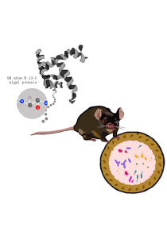

# Proteomic SIP Replicated Time Series Experiment 
This repository contains code and metadata required to visualize and analyze data produced by a Proteomic SIP experiment examining 13C algal protein assimilation in the mouse gut microbiome.

The gut microbiome is closely related to host health and plays a major role in host nutrition by assisting in the metabolism of dietary substrates that the host ingests. The ecological processes that dictate how dietary nutrients affect the gut microbiome’s ecology, and furthermore, host health, are poorly understood. Proteomic Stable Isotope Probing (SIP) is a method that can link an isotopically-labeled substrate to the organisms that assimilate it, thereby identifying the organisms and putative ecological processes involved in the substrate’s degradation. Proteins synthesized by microbes that assimilate the substrate into anabolic pathways will be enriched with the stable isotope, these are referred to as labeled proteins. Matching labeled mass spectra to known peptide sequences encoded by specific microbial populations enables the identification of active taxa and allows for quantification of their activity and specificity. We applied Proteomic SIP in the mouse gut microbiome to show that this method can be adapted to draw causal inferences about the effect of dietary substrates on the gut microbiome. We showed that Proteomic SIP can be successfully implemented in the mouse gut microbiome. We also demonstrated that this method can detect the biological response of the microbial community to dietary substrates.  

## Objectives
* Calculate FDR
* Visualize labeling of the community over time
* Identify organisms that assimilated the labeled substrate
* Visualize distribution of 13C enrichment over time
* Visualize taxonomic profile represented in labeled and unlabeled proteins over time

## Requirements and dependencies
* Python 3.13.5
* Pandas 3.0.0
* Numpy 2.4.2
* Matplotlib 3.10.8
* R version 4.5.1
* phyloseq 1.52.0
* vegan 2.7-2
* compositions 2.0-9
* Hotelling 1.0-8