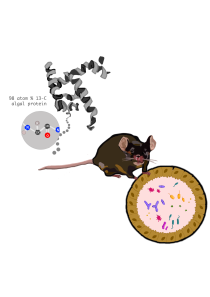
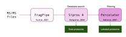

# Proteomic SIP Time Series Experiment 
This repository contains code and metadata required to visualize and analyze data produced by a Proteomic SIP experiment examining <sup>13</sup>C algal protein assimilation in the mouse gut microbiome.

<p align="center">
    

The gut microbiome is closely related to host health and plays a major role in host nutrition by assisting in the metabolism of dietary substrates that the host ingests. The ecological processes that dictate how dietary nutrients affect the gut microbiome’s ecology, and furthermore, host health, are poorly understood. Proteomic Stable Isotope Probing (SIP) is a method that can link an isotopically-labeled substrate to the organisms that assimilate it, thereby identifying the organisms and putative ecological processes involved in the substrate’s degradation. Proteins synthesized by microbes that assimilate the substrate into anabolic pathways will be enriched with the stable isotope, these are referred to as labeled proteins. Matching labeled mass spectra to known peptide sequences encoded by specific microbial populations enables the identification of active taxa and allows for quantification of their activity and specificity. We applied Proteomic SIP in the mouse gut microbiome to show that this method can be adapted to draw causal inferences about the effect of dietary substrates on the gut microbiome *in vivo*. We showed that Proteomic SIP can be successfully implemented in the mouse gut microbiome. We also demonstrated that this method can detect the biological response of the microbial community to dietary substrates.  

## Bioinformatic pipeline
<p align="center">
    

## Objectives
* Count the number of labeled PSMs, peptides, and proteins detected in Percolator output 
* Calculate False Positive Rate (FPR)
* Visualize how the proportion of labeled PSMs out of total PSMs changes over time and determine if changes are significant
* Visualize distribution of <sup>13</sup>C enrichment over time
* Compare empirical counts of labeled PSMs for detected genera with what would be expected under null conditions
* Identify organisms that assimilated the labeled substrate, and those that did not based on a bar chart of proportional specrtal counts assigned to the most abundant genera
* Visualize the relationship between average <sup>13</sup>C enrichment and spectral count for significantly labeled genera
* Generate a phylogenetic tree and heatmap to determine if evolutionary relationships predict assimilation of <sup>13</sup>C algal protein

## Requirements and dependencies
* Python 3.13.5
* Pandas 3.0.0
* Numpy 2.4.2
* Matplotlib 3.10.8
* R version 4.5.1
* phyloseq 1.52.0
* vegan 2.7-2
* ggplot2_4.0.1
* compositions 2.0-9
* Hotelling 1.0-8
* ggnewscale_0.5.2
* dplyr_1.1.4
* ggtreeExtra_1.18.1
* ape_5.8-1
* ggtree_3.16.3
* caper_1.0.4

## Directory structure
```
├── images
├── community_analysis
│   ├── count_detected_PSMsPeptidesProteins.py
│   ├── calculate_FPR.py
│   ├── proportion_labeled_PSMs.py
│   ├── enrichment_distributions.py
│   ├── generate_phyloseq.py
│   └── NMDS_and_PERMANOVA.R
├── taxonomic_analysis
│   ├── null_distributions.py
│   ├── subset_unlabeled.py
│   ├── taxonomy_bar_chart.py
│   ├── cluster_taxa.R
│   └── averageEnrichment_spectralCount_bubblePlot.py
└── phylogenetic and functional analysis
    ├── trait_data.py
    └── phylogenetic_functions_tree.R
```

### Community Analysis
| Script | Description |
| --- | --- |
| `count_detected_PSMsPeptidesProteins.py` | Count the number of labeled PSMs, peptides, and proteins reported by Percolator |
| `calculate_FPR.py` | Calculate dataset false positive rate |
| `proportion_labeled_PSMs.py` | Visualize proportion of labeled PSMs out of all PSMs. Generates input for `labeling_over_time.R` |
| `labeling_over_time.R` | Determine if amount of <sup>13</sup>C labeling changes significantly over time |
| `enrichment_distributions.py` | Visualize <sup>13</sup>C enrichment distributions of all labeled PSMs |
| `generate_phyloseq.py` | Parse data into tables that can be used to make a phyloseq object in R. Generates input for `NMDS_and_PERMANOVA.R` and `cluster_taxa.R` |
| `NMDS_and_PERMANOVA.R` | Use tables output by `generate_phyloseq.py` to run NMDS ordination and PERMANOVAs |

### Taxonomic Analysis
| Script | Description |
| --- | --- |
| `null_distributions.py` | Determine which organisms were significantly labeled using null distributions |
| `subset_unlabeled.py` | Subset unlabeled PSMs from total proteome to generate CSV representing unlabeled proteome. Generates input for `taxonomy_bar_chart.py` |
| `taxonomy_bar_chart.py` | Visualize how proportional spectral counts of abundant genera change over time in labeled and unlabeled proteomes |
| `cluster_taxa.R` | Cluster genera based on average <sup>13</sup>C enrichment or labeled spectral counts to identify genera that should be included in bubble plot |
| `averageEnrichment_spectralCount_bubblePlot.py` | Visualize relationship between average enrichment and spectral count as a bubble plot |

### Phylogenetic and Functional Analysis
| Script | Description |
| --- | --- |
| `trait_data.py` | Parse data and generate tables that can be used to plot phylogenetic tree heatmap. Generates input for `phylogenetic_functions_tree.R` |
| `phylogenetic_functions_tree.R` | Plot phylogenetic tree with all detected genera and a heatmap displaying their <sup>13</sup>C assimilation patterns |
